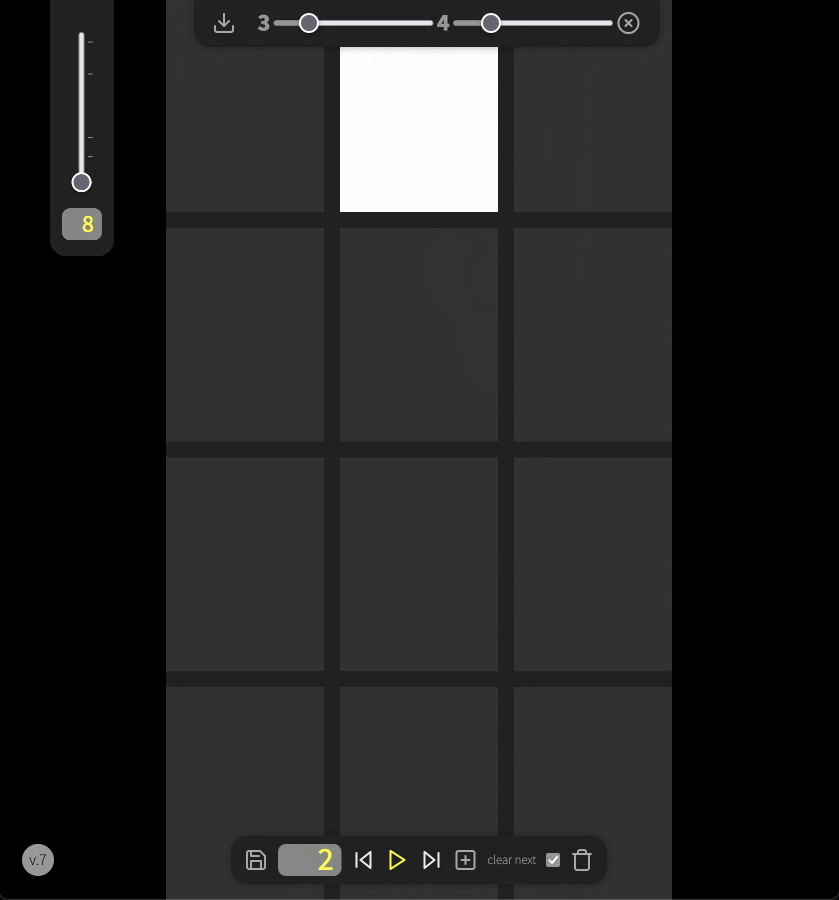
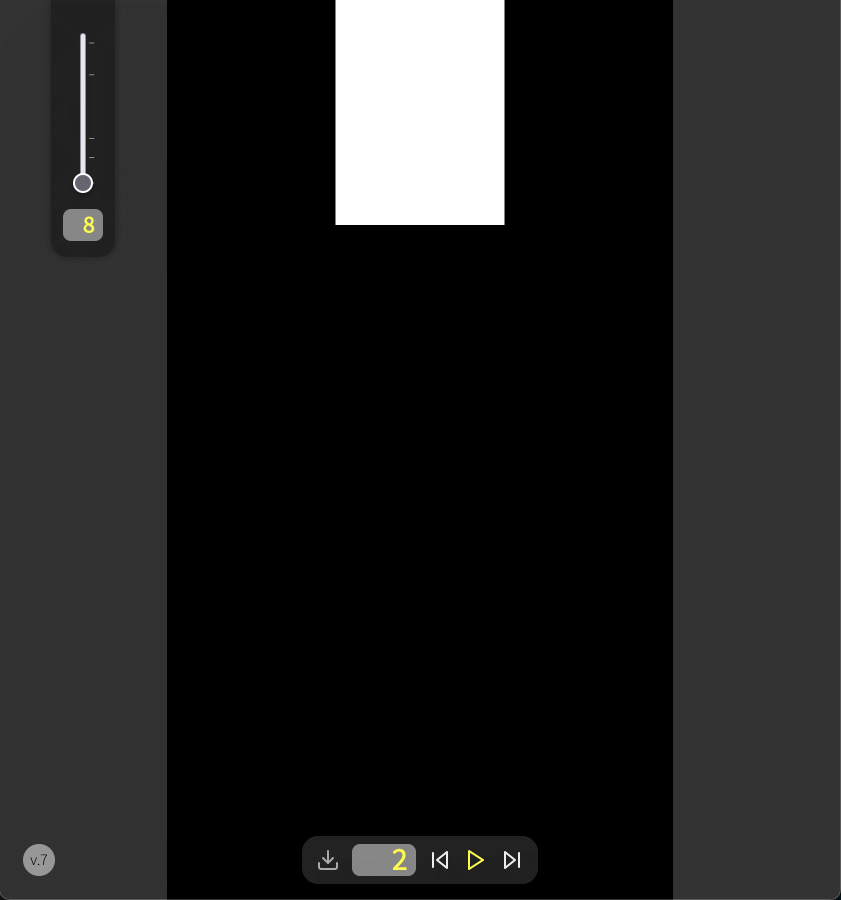

# Animator
Est un outil frustre d'animation de megapixels sur grille.  

Il a été écrit pour un atelier de Savoir-Faire, avec cette idée un peu naïve de convaincre les étudiants de produire des animations non figuratives afin d'expérimenter le rythme, les protocoles et les 'logiques' narratives intrinsèques.  
Outil imaginé et codé pour les étudiants de DN2, **DNMADe design graphique, Rennes** (langages visuels).

Le tout est composé de deux outils :
- un premier en HTML qui permet de créer les animations sur une grille variable.
- un second qui produit les séquences bitmap à partir d'un fichier d'animation.

L'outil a été initialement conçu pour produire des animations sur écran 16:9 (fullHD ou UHD) en portrait (affiche numérique).
Animator fonctionne en ligne (ou sur un serveur local) pour la partie web (la gestion des fichiers se fait en js avec l'objet Fetch()).

## Animator (html)

La **version 11** (Janv. 24), est une version spécifique. Elle fait disparaitre l'interface de redimensionnement de la matrice (dimension fixe). Elle ajoute un bouton de connexion (via dongle usb-to-rs485 + api Web Serial) à l'afficheur XY5 7x7 d'Alfazeta (matrice flipdot). Une fois la connexion établie, le XY5 affiche l'animation en temps réel.  
La connexion (api web serial) est compatible avec Google Chrome et son fork de chez Microsoft.

### Mode Éditeur

#### Dans la partie supérieure :
- importer un fichier d'anim (format json)
- nombre de colonnes __(absent sur la version 11)__
- nombre de lignes __(absent sur la version 11)__
- connecter l'afficheur XY5 7x7 d'Alfazeta __(uniquement sur la version 11)__

#### Dans la partie inférieure : 
- sauvegarder une animation
- Numéro de l'image encours
- image précédente
- lire l'animation (sur la version 11, lecture de l'animation sur l'afficheur XY5)
- image suivante
- insérer une image
- une case à cocher pour effacer ou pas la grille en cours pour la nouvelle image
- supprimer l'image encours

#### À gauche :
- réglage de la vitesse de l'animation

### Mode Lecteur
Pour passer en mode lecteur, il suffit d'ajouter `#player` à l'url.  
La grille disparaît et l'interface se simplifie.  

#### Dans la partie inférieure : 
- importer un fichier d'animation (format json)
- Numéro de l'image encours
- image précédente
- lire l'animation
- image suivante

#### À gauche :
- réglage de la vitesse de l'animation

en mode lecture, le player disparaît. Il suffit d'appuyer la `barre d'espace` du clavier pour arrêter la lecture et faire réapparaitre l'interface.

Il existe quelques raccourcis claviers :
- `flèche gauche` : image précédente
- `flèche droite` : image suivante
- `barre d'espace` : lecture / stop
- `Escape` : arrêt de la lecture (réapparition du lecteur)

_Notes_ :  
Le Format de fichier exporté est un objet JSON qui contient, taille de la grille, vitesse de l'animation, et la liste des 'pixels' allumés pour chaque image. (_merci à Gaïd pour l'idée du numérotage des cases_)

## Animator_Producer (Processing®)
est le pendant d' `Animator`. Il permet de produire les images bitmap correspondant à un fichier d'animation généré avec `animator`.    
Au lancement du script, une boite de dialogue s'ouvre pour choisir le fichier d'animation, puis les images sont produites. Le script s'arrête (quitte) à la fin du processus.  
La séquence d'images est créée dans un dossier au nom du fichier d'animation, dans le dossier du fichier Processing (`.pde`). Les images sont numérotées sur 3 chiffres `img-001.png`.  
Par défaut les images produites sont en fullHD  en portrait, il suffit de modifier les paramètres `size` dans le script. Le script a été écrit sur un Macbook Pro avec écran retina, Processing™ propose un paramètre `screenDensity`. il est réglé à `2`, la dimension de l'image en `540 x 960`, soit une image en HD.   

_Notes_ :  
L'enregistrement d'images sous P5js® nécessite la validation de l'utilisateur. Pour éviter ce désagrément, il m'a semblé plus judicieux d'utiliser Processing® qui n'a pas cette contrainte (due aux "bacs à sable" —_sandbox_— des navigateurs)

PS : Le code est brouillon, mais l'app est fonctionnelle en état. Il reste sans doute encore des bugs. Pensez à le signaler si vous utilisez.
